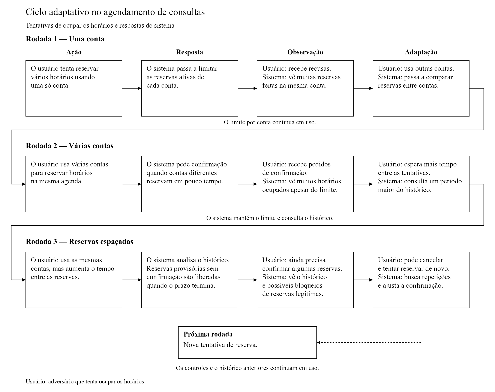

# Análise de Sistema Adversarial: Agendamento de Consultas

## 3. Desenvolvimento

### 3.1 Descrição do sistema adversarial
### 3.1 Descrição do sistema adversarial

#### Sistema e interação analisada

O Sistema de Agendamento de Consultas centraliza a publicação de horários por profissionais de saúde e a busca e reserva desses horários por pacientes. O sistema considera os perfis Visitante, Paciente, Profissional e Administrador, com controle de acesso baseado em papéis (RBAC) gerenciado pelo backend, conforme a especificação anterior do grupo na disciplina de Engenharia de Software Seguro.

Neste trabalho, o recorte é **a disputa pela disponibilidade dos horários de uma agenda por meio da criação, confirmação e cancelamento de reservas**. O adversário utiliza o fluxo destinado aos pacientes para ocupar vários horários sem intenção de realizar as consultas, dificultando o agendamento por outras pessoas. O defensor é o sistema, cujas políticas são configuradas e revisadas pelo administrador. Esse recorte corresponde aos jogadores A e B do modelo estático e à sequência de adaptações do modelo dinâmico.

A análise considera uma agenda com quantidade finita de horários. Como proposta para uma implementação posterior, cada horário pode estar disponível, reservado provisoriamente ou confirmado. Uma reserva provisória retém o horário enquanto aguarda confirmação e pode expirar; o cancelamento libera o horário. O backend deve impedir que duas reservas ativas ocupem o mesmo horário. Os controles de limitação e confirmação discutidos nas seções seguintes são propostas de desenho, não funcionalidades cuja implementação foi verificada.

Ficam fora do recorte o atendimento clínico, prontuários, pagamentos e a implementação de ataques. As tentativas abusivas e respostas do defensor são situações hipotéticas para a modelagem.

#### Atores, objetivos, capacidades e informações

| Ator | Objetivo | Ações ou capacidades | Informações observáveis | Restrições ou custos |
| --- | --- | --- | --- | --- |
| **Visitante** | Encontrar profissionais e opções de atendimento. | Consultar a oferta pública de profissionais e horários; iniciar cadastro. | Informações públicas dos profissionais e horários anunciados como disponíveis. | Não pode reservar sem autenticação; não acessa reservas ou dados de outros pacientes. |
| **Paciente legítimo** | Conseguir e manter consultas de que necessita. | Solicitar, confirmar, consultar e cancelar suas próprias reservas. | Disponibilidade apresentada, situação das próprias reservas, recusas, pedidos de confirmação e prazos comunicados. | Oferta finita de horários, tempo para confirmar e limites que podem afetar acompanhamentos frequentes. |
| **Usuário adversarial — Jogador A** | Monopolizar horários e reduzir o acesso dos pacientes legítimos. | Usar as operações de reserva e cancelamento; repetir solicitações; no cenário hipotético, operar múltiplas contas e variar os intervalos das tentativas. Também pode optar pelo uso regular, como na ação A1. | Respostas às próprias solicitações, disponibilidade publicada, exigência de confirmação e expiração das próprias reservas provisórias. | Esforço para manter contas, tempo entre tentativas, verificações adicionais e possibilidade de recusa ou bloqueio. Não se pressupõe acesso administrativo ou a dados de outros pacientes. |
| **Profissional de saúde** | Disponibilizar sua agenda e atender pacientes, evitando ocupação improdutiva. | Publicar e administrar os horários da própria agenda; acompanhar os agendamentos autorizados para seu papel. | Horários ocupados e livres e situação das reservas da própria agenda, respeitando as permissões do sistema. | Capacidade limitada de atendimento e perda de oportunidades quando horários são retidos sem necessidade. |
| **Administrador** | Manter o serviço operante e revisar decisões de controle. | Configurar políticas de reserva, analisar alertas e revisar casos contestados, dentro de suas permissões. | Registros operacionais de solicitações, resultados, confirmações e cancelamentos necessários à revisão. | Custo de operação e análise; informação incompleta sobre a intenção de cada usuário; responsabilidade de evitar bloqueios indevidos. |
| **Sistema/defensor — Jogador B** | Preservar a disponibilidade da agenda e permitir reservas legítimas. | Validar autenticação e autorização; verificar disponibilidade; aceitar ou recusar solicitações; aplicar os controles propostos de limite, confirmação e expiração; registrar eventos. | Conta solicitante, horário escolhido, instante da solicitação, situação da reserva e histórico das operações. | Recursos de processamento, necessidade de manter consistência e dificuldade de distinguir uso legítimo de abuso apenas pelo comportamento. |

O adversário é uma forma de atuação de um usuário com permissões de paciente, e não um novo papel de acesso. Da mesma forma, o administrador configura e revisa a defesa, enquanto o sistema aplica as decisões durante as solicitações.

#### Ativos e propriedades a preservar

- **Disponibilidade dos horários:** evitar que reservas sem intenção de atendimento eliminem as opções para pacientes legítimos.
- **Acesso justo:** permitir que pacientes diferentes disputem os horários sem concentração artificial por um único participante. Isso não pressupõe oferta suficiente para todas as demandas.
- **Integridade e consistência da agenda:** manter estados corretos e impedir reservas conflitantes para o mesmo horário.
- **Privacidade:** limitar a consulta de reservas e registros às informações autorizadas para cada papel.
- **Rastreabilidade:** conservar registros suficientes para relacionar tentativas, confirmações e cancelamentos e permitir revisão de decisões, sem usar dados clínicos para inferir intenção.

#### Pressupostos e possibilidades de falha

| Pressuposto | Como pode falhar | Consequência para o recorte |
| --- | --- | --- |
| **Uma conta representa adequadamente um participante.** | A mesma pessoa pode operar múltiplas contas, hipótese adotada no modelo dinâmico. | Um limite por conta pode ser respeitado individualmente e ainda permitir concentração de horários no conjunto. |
| **Uma reserva expressa intenção de comparecer à consulta.** | O participante pode reservar deliberadamente sem intenção de atendimento. | Horários deixam de estar disponíveis apesar de não atenderem a uma necessidade real. |
| **Confirmações e prazos aumentam o custo do abuso sem impedir o uso legítimo.** | O adversário pode concluir confirmações, enquanto um paciente legítimo pode ter dificuldade para responder no prazo. | O abuso pode persistir e reservas legítimas podem expirar; a defesa precisa permitir revisão. |
| **Padrões de solicitação ajudam a distinguir abuso de uso regular.** | Pacientes distintos podem agir em horários próximos; o adversário pode espaçar suas tentativas. | Podem surgir falsos positivos e tentativas abusivas não detectadas, exigindo análise de histórico e cautela nas decisões. |

#### Diagrama de contexto

O diagrama mostra os participantes e as interações com o sistema dentro do recorte. O adversário utiliza a mesma interface de reservas do paciente; suas respostas observáveis permitem adaptar a ação seguinte. Não se pressupõe que ele tenha acesso às regras internas de detecção.

#### Por que o sistema é adversarial?

O conflito está no uso de um recurso limitado: os horários da agenda. Pacientes legítimos procuram consultas necessárias; o adversário procura reter esses horários para impedir ou dificultar o acesso de outras pessoas; o defensor procura preservar o serviço e reduzir a ocupação abusiva. A intenção do adversário é incompatível com a finalidade do agendamento.

O caráter adversarial aparece na escolha deliberada e na adaptação: ao receber uma recusa por limite de reservas, o usuário pode distribuir as tentativas entre contas; ao perceber confirmações adicionais, pode alterar o intervalo das solicitações. O defensor também observa os registros e ajusta sua resposta. Uma falta isolada ou um cancelamento legítimo não comprova essa intenção. A análise trata da ocupação intencional e adaptativa, que pode ocorrer mesmo por operações válidas e com o RBAC funcionando corretamente.

Assim, a questão central das próximas seções é como conter a concentração de horários sem impor custos excessivos ou restrições indevidas aos pacientes legítimos.

### 3.2 Modelo estratégico estático

**Definição dos Jogadores e Ações**
* **Jogador A (Adversário):** Usuário com intenções maliciosas querendo uma quebra de agenda.
  * **Ação A1 (Normal):** Agenda apenas consultas necessárias (segue o protocolo correto).
  * **Ação A2 (Reservas Abusivas):** Tenta agendar vários horários para bloquear a agenda.
* **Jogador B (Defensor):** O sistema de Agendamento.
  * **Ação B1 (Controle Normal):** Permite agendamentos sem limites rígidos.
  * **Ação B2 (Controle Reforçado):** Aplica limites estritos, verificação de identidade e bloqueios por comportamento.

**Matriz de Decisão**
Os valores representam a ordem de preferência de 0 (pior cenário) a 3 (melhor cenário). A ordem no par é **(Payoff do Jogador A, Payoff do Jogador B)**.

| Jogador A \ Jogador B | Ação B1 (Controle Normal) | Ação B2 (Controle Reforçado) |
| :--- | :--- | :--- |
| **Ação A1 (Normal)** | (2, 3) | (1, 2) |
| **Ação A2 (Reservas Abusivas)** | (3, 0) | (0, 1) |

**Justificativa dos Resultados:**
* **(2, 3) - Regular vs Normal:** O adversário age como um usuário comum e consegue sua consulta facilmente (2). O sistema atinge seu estado ideal: máxima disponibilidade com excelente usabilidade (3).
* **(3, 0) - Abusivo vs Normal:** O adversário consegue explorar a falta de controles e monopoliza a agenda com sucesso (3). O sistema sofre o pior impacto possível, ficando indisponível para usuários legítimos (0).
* **(1, 2) - Regular vs Reforçado:** O adversário desiste do ataque e tenta um uso normal, mas sofre com a lentidão e burocracia dos controles de segurança (1). O sistema está seguro, mas penaliza a experiência dos usuários com atritos desnecessários (2).
* **(0, 1) - Abusivo vs Reforçado:** O ataque do adversário é detectado e bloqueado (0). O sistema sobrevive e mitiga a ameaça, mas opera em estado de alerta e consumindo recursos de processamento (1).

**Análise Estratégica:**
* **Melhores respostas:**
  * Se o Sistema escolhe B1, a melhor resposta do Adversário é A2, pois 3 > 2.
  * Se o Sistema escolhe B2, a melhor resposta do Adversário é A1, pois 1 > 0.
  * Se o Adversário escolhe A1, a melhor resposta do Sistema é B1, pois 3 > 2.
  * Se o Adversário escolhe A2, a melhor resposta do Sistema é B2, pois 1 > 0.
* **Estratégia Dominante:** Nenhum dos jogadores possui uma estratégia dominante. A melhor escolha de um depende estritamente do que o outro fizer.
* **Equilíbrio (Nash):** Neste cenário, não existe um equilíbrio estático (nenhum resultado onde ambos não queiram mudar). Trata-se de um ciclo (semelhante ao jogo de "polícia e ladrão"): se o sistema relaxa (B1), o adversário ataca (A2). Se o adversário ataca (A2), o sistema reforça (B2). Se o sistema reforça (B2), o adversário recua (A1). Se o adversário recua (A1), o sistema relaxa para melhorar a usabilidade (B1).
* **Impacto no Sistema e Usuários Legítimos:** O fato de não haver um equilíbrio perfeito mostra que a segurança tem um custo. Quando o sistema é forçado a ir para B2 (Controle Reforçado) para conter o adversário, os usuários legítimos pagam o preço da mitigação por meio de verificações extras, lentidão e bloqueios acidentais (falsos positivos).

### 3.3 Modelo estratégico dinâmico

O modelo dinâmico acompanha a disputa pela disponibilidade de horários. O adversário mantém o objetivo de ocupar a agenda e dificultar o acesso de outros pacientes, mas muda sua forma de reservar quando encontra uma restrição. O defensor procura conter o abuso e permitir reservas legítimas, ajustando seus controles conforme observa as tentativas.

As rodadas representam **hipóteses de análise**, não vulnerabilidades comprovadas no sistema de agendamento. Os limites, as confirmações e a análise de padrões descritos abaixo são controles propostos. O cenário considera que o adversário consegue operar mais de uma conta e observar as respostas às suas próprias solicitações. O defensor observa os registros de conta, horário escolhido, instante da solicitação e situação da reserva; a semelhança entre solicitações é um indício, não uma prova de que as contas pertencem à mesma pessoa.

#### Rodadas de ação, resposta, observação e adaptação

| Rodada | Ação do participante | Resposta do sistema ou defensor | O que se torna observável? | Adaptação para a rodada seguinte |
| --- | --- | --- | --- | --- |
| **1 — Concentração em uma conta** | O adversário tenta reservar vários horários pela mesma conta, buscando reduzir as opções disponíveis para outros pacientes. | Ao observar a concentração, o defensor aplica um limite de reservas ativas por conta às novas solicitações. Reservas pendentes de confirmação também entram nessa contagem. | O adversário vê que novas reservas passam a ser recusadas naquela conta e infere a existência de um limite. O defensor observa o volume de tentativas e os horários ocupados. | O adversário passa a distribuir as solicitações entre várias contas. O defensor mantém o limite por conta e passa a considerar a distribuição das reservas entre contas. |
| **2 — Distribuição entre contas** | O adversário usa várias contas, respeitando o limite individual, mas solicita horários da mesma agenda em intervalos próximos. | O defensor mantém o limite anterior e compara padrões de tempo e de horários entre contas. Solicitações com sinais de concentração passam por confirmação adicional antes de serem efetivadas. | O adversário observa quais solicitações exigem confirmação e suspeita que o conjunto das tentativas está chamando atenção. O defensor percebe que o total de horários ocupados pode crescer mesmo com cada conta abaixo do limite. | O adversário continua usando várias contas, mas espaça as tentativas. O defensor conserva os registros e amplia o período de observação, pois o volume por conta não explica sozinho a ocupação da agenda. |
| **3 — Distribuição ao longo do tempo** | O adversário usa as contas da rodada anterior para reservar com intervalos maiores, tentando reduzir o sinal de concentração imediata. | O defensor mantém os controles anteriores e analisa o histórico de reservas ativas, confirmações e cancelamentos em um período maior. Solicitações suspeitas exigem confirmação; reservas provisórias têm prazo de expiração para não reter horários indefinidamente. | O adversário observa que algumas solicitações ainda exigem confirmação e se os horários provisórios voltam a ficar disponíveis quando o prazo acaba. O defensor relaciona a ocupação persistente ao histórico, mas também observa casos legítimos submetidos à verificação. | O adversário pode reduzir o volume ou tentar cancelar e reservar novamente para renovar a retenção de horários. O defensor passa a considerar a repetição desse fluxo no histórico e ajusta os critérios de confirmação com atenção aos bloqueios indevidos. |

#### Como uma rodada altera a seguinte

A rodada 2 surge porque o limite aplicado na rodada 1 torna menos útil concentrar reservas em uma única conta. A rodada 3 mantém as múltiplas contas da rodada 2 e altera o intervalo entre as solicitações em resposta às confirmações adicionais. O histórico de tentativas, reservas e decisões permanece disponível ao defensor; os controles anteriores continuam ativos.

O limite por conta restringe novas reservas, mas não libera automaticamente horários já confirmados. Da mesma forma, observar padrões semelhantes entre contas não identifica com certeza quem as controla. A sequência mostra aprendizado e mudança de estratégia, sem presumir que uma defesa encerra a disputa.

#### Observação e decisões de cada lado

- **Quem observa quem?** O adversário observa as respostas às próprias solicitações: aceitação, recusa, pedido de confirmação e expiração de reservas provisórias. A partir delas, formula hipóteses sobre os controles. O defensor observa as solicitações e seus resultados registrados, inclusive as tentativas recusadas, para comparar o comportamento entre rodadas. As regras internas de detecção não precisam ser expostas nas mensagens ao usuário.
- **O que cada lado consegue mudar?** O adversário altera o número de contas, a quantidade de reservas, os horários escolhidos e o intervalo entre as tentativas. O defensor altera os limites, o período analisado no histórico, os critérios de confirmação e o prazo das reservas provisórias. As mudanças preservam as reservas legítimas já confirmadas e a possibilidade de revisão de decisões indevidas.
- **O que dispara uma adaptação?** Para o adversário, uma recusa ou uma confirmação adicional indica que sua forma atual de reservar encontrou uma restrição. Para o defensor, a concentração de horários, a persistência do padrão após uma mudança de controle e a frequência de verificações indevidas indicam que os critérios precisam ser reavaliados. Os dois lados decidem com informação incompleta: uma reserva aceita não prova ausência de monitoramento, e um padrão semelhante não comprova abuso.

#### Custos da adaptação e efeitos sobre pacientes legítimos

| Rodada | Custo para o adversário | Custo para o defensor | Possível efeito sobre pacientes legítimos |
| --- | --- | --- | --- |
| **1** | Investir esforço em tentativas recusadas e manter novas contas para continuar a concentração. | Contar reservas por conta e tratar as solicitações acima do limite. | Pacientes que precisam de acompanhamentos frequentes podem atingir o limite, exigindo uma exceção justificada ou revisão. |
| **2** | Administrar várias contas e enfrentar confirmações adicionais. | Comparar registros entre contas e analisar solicitações sinalizadas. | Reservas feitas em horários semelhantes por pessoas diferentes podem exigir confirmação, aumentando o tempo para concluir o agendamento. |
| **3** | Esperar entre tentativas e manter o esforço por mais tempo, com risco de perder horários provisórios que expirem. | Consultar um histórico maior, acompanhar pendências e revisar decisões indevidas. | Pacientes com dificuldade para responder à confirmação podem perder uma reserva provisória e precisar solicitar outro horário. |

Os limites devem considerar necessidades legítimas de acompanhamento, e os casos contestados devem admitir revisão. O prazo de confirmação precisa ser comunicado de forma clara. O tratamento dos registros deve se limitar às informações necessárias à análise do agendamento, sem usar dados clínicos para inferir intenção. A avaliação dos controles considera tanto a redução da ocupação abusiva quanto os atrasos e as restrições impostas ao uso legítimo.

#### Corrida armamentista e continuidade da disputa

A corrida armamentista pode começar na passagem da rodada 1 para a 2: o adversário investe em mais contas para contornar o limite, e o defensor passa a comparar padrões entre contas. Na passagem para a rodada 3, o adversário investe mais tempo para disfarçar a concentração, enquanto o defensor amplia o histórico analisado e o esforço de revisão. Aumentar a complexidade da defesa também pode aumentar o custo de operação e o atrito para pacientes legítimos.

O objetivo do defensor não é acrescentar restrições indefinidamente, mas manter a disponibilidade dos horários com acesso legítimo e decisões revisáveis. Mesmo após os controles, permanece o risco de reservas abusivas que se parecem com o uso regular. A tentativa de cancelar e reservar novamente, indicada ao final da terceira rodada, exige que o histórico permaneça ligado à conta e ao horário, em vez de ser descartado a cada nova solicitação.

Este recorte corresponde ao abuso de um fluxo de negócio sensível: a OWASP inclui a ocupação de todos os horários de um serviço como exemplo de uso excessivo de reservas, na categoria API6:2023. A modelagem também se apoia na discussão da OWASP sobre abuso de funcionalidades válidas por automação. Essas referências fundamentam o cenário; as três rodadas e os controles apresentados são propostas para o sistema de agendamento. As fontes estão em [fontes/referencias.md](fontes/referencias.md).

#### Diagrama do ciclo adaptativo

O diagrama apresenta as três rodadas na sequência ação → resposta → observação → adaptação. A adaptação de uma rodada leva à ação da seguinte. A seta tracejada ao final indica uma nova tentativa de reserva, que será avaliada com os controles e o histórico das rodadas anteriores. No diagrama, “usuário” representa o adversário que tenta ocupar a agenda.

[Fonte editável do diagrama em draw.io](diagramas/fontes/ciclo-adaptativo.drawio).

### 3.4 Ameaças e riscos
*(A Pessoa 4 vai preencher esta parte)*
